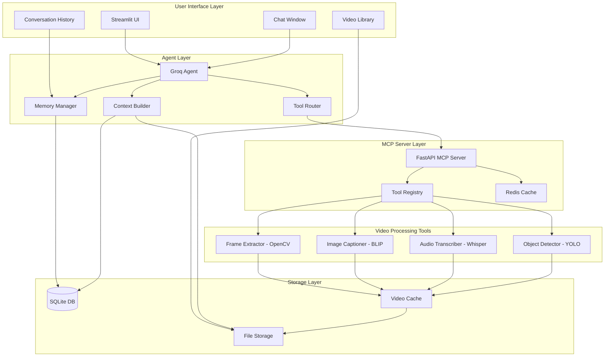
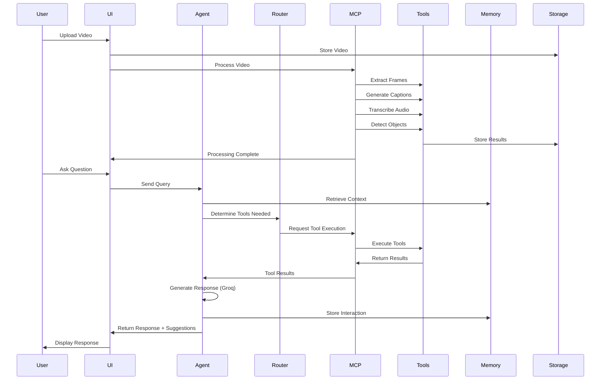

# Design Document

## Overview

BRI is a multimodal conversational agent for video processing built on a modular architecture that separates concerns between the user interface, agent logic, video processing tools, and storage. The system uses Groq's LLM for natural language understanding and response generation, integrates with open-source video processing tools via an MCP (Model Context Protocol) server, and maintains conversational memory using a local database.

The architecture follows a layered approach:
- **Presentation Layer**: Streamlit-based UI with feminine design touches
- **Agent Layer**: Groq-powered conversational agent with tool routing and memory management
- **Tool Layer**: MCP server exposing video processing capabilities (captioning, object detection, transcription)
- **Storage Layer**: SQLite for memory and metadata, file system for video and extracted assets

## Architecture

### High-Level System Architecture



### Agent Workflow



## Components and Interfaces

### 1. User Interface (Streamlit)

**Purpose**: Provide a warm, approachable interface for video upload, chat interaction, and result visualization.

**Key Components**:
- **Welcome Screen**: Landing page with friendly greeting and upload prompt
- **Video Library**: Grid view of uploaded videos with thumbnails
- **Chat Window**: Conversational interface with message history
- **Video Player**: Embedded player with timestamp navigation
- **History Panel**: Sidebar showing past conversations per video

**Design Specifications**:
- Color Palette: Soft pastels (blush pink #FFB6C1, lavender #E6E6FA, teal #40E0D0, cream #FFFDD0)
- Typography: Rounded sans-serif fonts (e.g., Nunito, Quicksand)
- Spacing: Generous padding and margins for breathing room
- Animations: Subtle fade-ins, smooth transitions
- Microcopy: Friendly, supportive language throughout

**Interface**:
```python
class BRIInterface:
    def render_welcome_screen(self) -> None
    def render_video_library(self, videos: List[Video]) -> None
    def render_chat_window(self, video_id: str) -> None
    def render_video_player(self, video_path: str, timestamp: Optional[float]) -> None
    def handle_video_upload(self, file: UploadedFile) -> str
    def handle_user_message(self, message: str, video_id: str) -> Response
```

### 2. Groq Agent

**Purpose**: Core conversational agent that understands user queries, routes to appropriate tools, and generates empathetic responses.

**Key Responsibilities**:
- Natural language understanding via Groq API
- Tool routing based on query analysis
- Response generation with context awareness
- Memory management for conversation continuity
- Follow-up suggestion generation

**Interface**:
```python
class GroqAgent:
    def __init__(self, groq_api_key: str, mcp_client: MCPClient, memory: Memory):
        self.groq_client = GroqClient(api_key=groq_api_key)
        self.mcp_client = mcp_client
        self.memory = memory
        self.router = ToolRouter()
    
    async def chat(
        self,
        message: str,
        video_id: str,
        image_base64: Optional[str] = None
    ) -> AssistantMessageResponse:
        """Main entry point for processing user messages"""
        
    def _should_use_tool(self, message: str) -> Optional[str]:
        """Determine if a tool is needed for the query"""
        
    async def _run_with_tool(
        self,
        message: str,
        video_id: str,
        image_base64: Optional[str]
    ) -> str:
        """Execute tool-based response"""
        
    async def _respond_general(self, message: str) -> str:
        """Generate general conversational response"""
        
    def _add_memory_pair(self, message: str, response: str) -> None:
        """Store interaction in memory"""
```

**Groq Integration**:
- Model: llama-3.1-70b-versatile (or llama-4-scout for faster responses)
- System Prompt: Defines BRI's personality as warm, supportive, and knowledgeable
- Temperature: 0.7 for balanced creativity and accuracy
- Max Tokens: 1024 for comprehensive responses

### 3. Tool Router

**Purpose**: Analyze user queries to determine which video processing tools are needed and coordinate their execution.

**Routing Logic**:
- **Caption-based queries**: "What's happening?", "Describe the scene"
- **Transcript-based queries**: "What did they say?", "Find when they mentioned X"
- **Object-based queries**: "Show me all the dogs", "Find scenes with a car"
- **Temporal queries**: "What happened at 2:30?", "Show me the beginning"
- **Similarity queries**: "Find similar moments", "Show me more like this"

**Interface**:
```python
class ToolRouter:
    def analyze_query(self, query: str, context: ConversationContext) -> ToolPlan:
        """Determine which tools to use and in what order"""
        
    def requires_captions(self, query: str) -> bool:
        """Check if query needs image captions"""
        
    def requires_transcripts(self, query: str) -> bool:
        """Check if query needs audio transcripts"""
        
    def requires_objects(self, query: str) -> bool:
        """Check if query needs object detection"""
        
    def extract_timestamp(self, query: str) -> Optional[float]:
        """Extract timestamp from query if present"""

@dataclass
class ToolPlan:
    tools_needed: List[str]  # e.g., ['captions', 'objects']
    execution_order: List[str]
    parameters: Dict[str, Any]
```

### 4. MCP Server

**Purpose**: Expose video processing tools via a standardized API that the agent can discover and invoke.

**Architecture**:
- FastAPI server with RESTful endpoints
- Redis for caching tool results
- Tool registry for dynamic discovery
- Standardized input/output schemas

**Endpoints**:
```python
# Tool Discovery
GET /tools
Response: List[ToolDefinition]

# Tool Execution
POST /tools/{tool_name}/execute
Request: {
    "video_id": str,
    "parameters": Dict[str, Any]
}
Response: {
    "status": "success" | "error",
    "result": Any,
    "cached": bool
}

# Video Processing (Batch)
POST /videos/{video_id}/process
Request: {
    "tools": List[str]  # e.g., ['frames', 'captions', 'audio', 'objects']
}
Response: {
    "status": "processing" | "complete",
    "progress": float,
    "results": Dict[str, Any]
}
```

**Tool Registry**:
```python
class ToolRegistry:
    def __init__(self):
        self.tools: Dict[str, Tool] = {}
        
    def register_tool(self, tool: Tool) -> None:
        """Register a new tool"""
        
    def get_tool(self, name: str) -> Optional[Tool]:
        """Retrieve tool by name"""
        
    def list_tools(self) -> List[ToolDefinition]:
        """List all available tools"""

@dataclass
class ToolDefinition:
    name: str
    type: str  # 'function'
    description: str
    parameters: Dict[str, Any]  # JSON Schema
```

### 5. Video Processing Tools

#### Frame Extractor (OpenCV)
**Purpose**: Extract frames from video at regular intervals or specific timestamps.

```python
class FrameExtractor:
    def extract_frames(
        self,
        video_path: str,
        interval_seconds: float = 2.0,
        max_frames: int = 100
    ) -> List[Frame]:
        """Extract frames at regular intervals"""
        
    def extract_frame_at_timestamp(
        self,
        video_path: str,
        timestamp: float
    ) -> Frame:
        """Extract single frame at specific time"""
        
    def get_video_metadata(self, video_path: str) -> VideoMetadata:
        """Get video duration, fps, resolution"""

@dataclass
class Frame:
    timestamp: float
    image_path: str
    image_base64: str
    frame_number: int
```

#### Image Captioner (BLIP)
**Purpose**: Generate natural language descriptions of video frames.

```python
class ImageCaptioner:
    def __init__(self):
        self.model = BlipForConditionalGeneration.from_pretrained(
            "Salesforce/blip-image-captioning-large"
        )
        self.processor = BlipProcessor.from_pretrained(
            "Salesforce/blip-image-captioning-large"
        )
        
    def caption_frame(self, image_path: str) -> str:
        """Generate caption for a single frame"""
        
    def caption_frames_batch(self, image_paths: List[str]) -> List[Caption]:
        """Generate captions for multiple frames"""

@dataclass
class Caption:
    frame_timestamp: float
    text: str
    confidence: float
```

#### Audio Transcriber (Whisper)
**Purpose**: Transcribe audio from video with timestamps.

```python
class AudioTranscriber:
    def __init__(self):
        self.model = whisper.load_model("base")
        
    def transcribe_video(self, video_path: str) -> Transcript:
        """Transcribe entire video audio"""
        
    def transcribe_segment(
        self,
        video_path: str,
        start_time: float,
        end_time: float
    ) -> TranscriptSegment:
        """Transcribe specific time range"""

@dataclass
class Transcript:
    segments: List[TranscriptSegment]
    language: str
    full_text: str

@dataclass
class TranscriptSegment:
    start: float
    end: float
    text: str
    confidence: float
```

#### Object Detector (YOLO)
**Purpose**: Detect and track objects across video frames.

```python
class ObjectDetector:
    def __init__(self):
        self.model = YOLO("yolov8n.pt")
        
    def detect_objects_in_frames(
        self,
        frame_paths: List[str]
    ) -> List[DetectionResult]:
        """Detect objects in multiple frames"""
        
    def search_for_object(
        self,
        frame_paths: List[str],
        object_class: str
    ) -> List[ObjectOccurrence]:
        """Find all occurrences of specific object"""

@dataclass
class DetectionResult:
    frame_timestamp: float
    objects: List[DetectedObject]

@dataclass
class DetectedObject:
    class_name: str
    confidence: float
    bbox: Tuple[int, int, int, int]  # x, y, w, h

@dataclass
class ObjectOccurrence:
    timestamp: float
    frame_path: str
    confidence: float
```

### 6. Memory Manager

**Purpose**: Store and retrieve conversation history to maintain context across interactions.

**Storage Schema**:
```sql
-- Memory table
CREATE TABLE memory (
    message_id TEXT PRIMARY KEY,
    video_id TEXT NOT NULL,
    role TEXT NOT NULL,  -- 'user' or 'assistant'
    content TEXT NOT NULL,
    timestamp DATETIME DEFAULT CURRENT_TIMESTAMP,
    FOREIGN KEY (video_id) REFERENCES videos(video_id)
);

-- Videos table
CREATE TABLE videos (
    video_id TEXT PRIMARY KEY,
    filename TEXT NOT NULL,
    file_path TEXT NOT NULL,
    duration REAL,
    upload_timestamp DATETIME DEFAULT CURRENT_TIMESTAMP,
    processing_status TEXT DEFAULT 'pending'
);

-- Video context table (processed data)
CREATE TABLE video_context (
    context_id TEXT PRIMARY KEY,
    video_id TEXT NOT NULL,
    context_type TEXT NOT NULL,  -- 'frame', 'caption', 'transcript', 'object'
    timestamp REAL,
    data JSON NOT NULL,
    FOREIGN KEY (video_id) REFERENCES videos(video_id)
);
```

**Interface**:
```python
class Memory:
    def __init__(self, db_path: str):
        self.db_path = db_path
        self._setup_tables()
        
    def insert(self, memory_record: MemoryRecord) -> None:
        """Store a conversation turn"""
        
    def get_conversation_history(
        self,
        video_id: str,
        limit: int = 10
    ) -> List[MemoryRecord]:
        """Retrieve recent conversation for a video"""
        
    def get_by_message_id(self, message_id: str) -> MemoryRecord:
        """Retrieve specific message"""
        
    def reset_memory(self, video_id: str) -> None:
        """Clear conversation history for a video"""

@dataclass
class MemoryRecord:
    message_id: str
    video_id: str
    role: str
    content: str
    timestamp: datetime
```

### 7. Context Builder

**Purpose**: Aggregate video processing results and conversation history to provide rich context for the agent.

```python
class ContextBuilder:
    def __init__(self, db: Database, file_store: FileStore):
        self.db = db
        self.file_store = file_store
        
    def build_video_context(self, video_id: str) -> VideoContext:
        """Compile all available data for a video"""
        
    def search_captions(
        self,
        video_id: str,
        query: str,
        top_k: int = 5
    ) -> List[Caption]:
        """Find relevant captions using similarity search"""
        
    def search_transcripts(
        self,
        video_id: str,
        query: str
    ) -> List[TranscriptSegment]:
        """Search transcript for keywords"""
        
    def get_frames_with_object(
        self,
        video_id: str,
        object_class: str
    ) -> List[Frame]:
        """Find frames containing specific object"""
        
    def get_context_at_timestamp(
        self,
        video_id: str,
        timestamp: float,
        window: float = 5.0
    ) -> TimestampContext:
        """Get all context around a specific time"""

@dataclass
class VideoContext:
    video_id: str
    metadata: VideoMetadata
    frames: List[Frame]
    captions: List[Caption]
    transcript: Transcript
    objects: List[DetectionResult]
    conversation_history: List[MemoryRecord]

@dataclass
class TimestampContext:
    timestamp: float
    nearby_frames: List[Frame]
    captions: List[Caption]
    transcript_segment: Optional[TranscriptSegment]
    detected_objects: List[DetectedObject]
```

## Data Models

### Core Data Models

```python
from pydantic import BaseModel
from typing import List, Optional, Dict, Any
from datetime import datetime

class Video(BaseModel):
    video_id: str
    filename: str
    file_path: str
    duration: float
    upload_timestamp: datetime
    processing_status: str  # 'pending', 'processing', 'complete', 'error'
    thumbnail_path: Optional[str] = None

class VideoMetadata(BaseModel):
    duration: float
    fps: float
    width: int
    height: int
    codec: str
    file_size: int

class AssistantMessageResponse(BaseModel):
    message: str
    frames: List[str] = []  # Frame image paths
    timestamps: List[float] = []
    suggestions: List[str] = []  # Follow-up questions
    
class UserQuery(BaseModel):
    video_id: str
    message: str
    timestamp: Optional[float] = None
    
class ToolExecutionRequest(BaseModel):
    tool_name: str
    video_id: str
    parameters: Dict[str, Any]
    
class ToolExecutionResponse(BaseModel):
    status: str  # 'success', 'error'
    result: Any
    cached: bool
    execution_time: float
```

## Error Handling

### Error Categories and Responses

1. **Video Upload Errors**
   - Invalid format: "Oops! I can only work with MP4, AVI, MOV, or MKV files. Want to try another format?"
   - File too large: "This video is a bit too big for me right now. Can you try one under 500MB?"
   - Upload failed: "Hmm, something went wrong with the upload. Mind giving it another shot?"

2. **Processing Errors**
   - Frame extraction failed: "I had trouble extracting frames, but I can still help with the audio!"
   - Transcription failed: "The audio was a bit tricky, but I can describe what I see in the video!"
   - Object detection failed: "I couldn't spot specific objects this time, but I can tell you what's happening overall!"

3. **Query Errors**
   - Ambiguous query: "I'm not quite sure what you're looking for. Could you be more specific?"
   - No results found: "I couldn't find that in the video, but here's what I did find..."
   - Timestamp out of range: "That timestamp is beyond the video length. Did you mean [suggested timestamp]?"

4. **System Errors**
   - Groq API unavailable: "I'm having trouble thinking right now. Give me a moment and try again!"
   - MCP server down: "My tools are taking a break. I can still chat about what we've already found!"
   - Database error: "I'm having trouble remembering our conversation. Let's start fresh!"

### Error Handling Strategy

```python
class ErrorHandler:
    @staticmethod
    def handle_tool_error(tool_name: str, error: Exception) -> str:
        """Generate friendly error message for tool failures"""
        
    @staticmethod
    def handle_api_error(error: Exception) -> str:
        """Handle Groq API errors gracefully"""
        
    @staticmethod
    def suggest_fallback(original_query: str, available_data: List[str]) -> str:
        """Suggest alternative approaches when primary method fails"""
```

## Testing Strategy

### Unit Testing

**Components to Test**:
1. **FrameExtractor**: Verify correct frame extraction at intervals and timestamps
2. **ImageCaptioner**: Test caption generation quality and batch processing
3. **AudioTranscriber**: Validate transcription accuracy and timestamp alignment
4. **ObjectDetector**: Test object detection accuracy and search functionality
5. **Memory**: Verify CRUD operations and conversation retrieval
6. **ToolRouter**: Test query analysis and tool selection logic

**Testing Approach**:
- Use sample videos (short clips, 10-30 seconds)
- Mock external API calls (Groq)
- Verify output formats match expected schemas
- Test edge cases (empty videos, corrupted files, etc.)

### Integration Testing

**Scenarios to Test**:
1. **End-to-End Video Processing**: Upload → Process → Query → Response
2. **Multi-Tool Queries**: Queries requiring multiple tools (captions + objects)
3. **Conversation Continuity**: Follow-up questions using memory
4. **Error Recovery**: Graceful degradation when tools fail
5. **Caching**: Verify Redis caching improves response times

### User Acceptance Testing

**Metrics**:
- User satisfaction rating (target: ≥4.5/5)
- Query accuracy (target: ≥90%)
- Response time (target: <3s for 80% of queries)
- "Feminine touch" feedback (target: ≥80% describe as approachable)

**Test Scenarios**:
- Upload various video types (tutorials, vlogs, sports, movies)
- Ask diverse questions (content, timestamps, objects, summaries)
- Test follow-up conversations
- Evaluate UI/UX warmth and approachability

## Performance Considerations

### Optimization Strategies

1. **Frame Extraction**:
   - Adaptive interval based on video length (longer videos = wider intervals)
   - Maximum frame limit to prevent memory issues
   - Lazy loading of frame images

2. **Caching**:
   - Redis cache for tool results (TTL: 24 hours)
   - In-memory cache for frequently accessed video metadata
   - Browser cache for frame thumbnails

3. **Batch Processing**:
   - Process captions in batches of 10 frames
   - Parallel tool execution where possible
   - Background processing for non-urgent tasks

4. **Database Optimization**:
   - Index on video_id and timestamp columns
   - Limit conversation history retrieval (last 10 messages)
   - Periodic cleanup of old data

### Scalability Considerations

- **Horizontal Scaling**: MCP server can run multiple instances behind load balancer
- **Storage**: Move to PostgreSQL and S3 for production
- **Queue System**: Add Celery for async video processing
- **CDN**: Serve static assets (frames, thumbnails) via CDN

## Security and Privacy

### Data Protection

1. **Local Storage**: Videos and data stored locally by default
2. **Memory Wipe**: Users can delete conversation history
3. **API Key Management**: Groq API key stored in environment variables
4. **Input Validation**: Sanitize all user inputs to prevent injection attacks

### Access Control

- Single-user mode for initial release
- Future: Add authentication for multi-user deployments
- Rate limiting on API endpoints to prevent abuse

## Deployment

### Development Setup

```bash
# Install dependencies
pip install -r requirements.txt

# Set environment variables
export GROQ_API_KEY="your_key_here"

# Initialize database
python scripts/init_db.py

# Start MCP server
python mcp_server/main.py

# Start Streamlit UI
streamlit run app.py
```

### Production Considerations

- Docker containers for each component
- Environment-based configuration
- Logging and monitoring (e.g., Sentry for errors)
- Backup strategy for database and videos
- Health check endpoints for all services

## Future Enhancements

1. **Voice Interaction**: Add voice input/output for accessibility
2. **Multi-Video Analysis**: Compare and analyze multiple videos
3. **Video Editing**: Basic clip extraction and compilation
4. **Collaborative Features**: Share videos and conversations
5. **Advanced Search**: Semantic search across all videos
6. **Custom Tools**: Allow users to add custom processing tools
7. **Mobile App**: Native mobile experience
8. **Real-time Streaming**: Support for live video analysis
