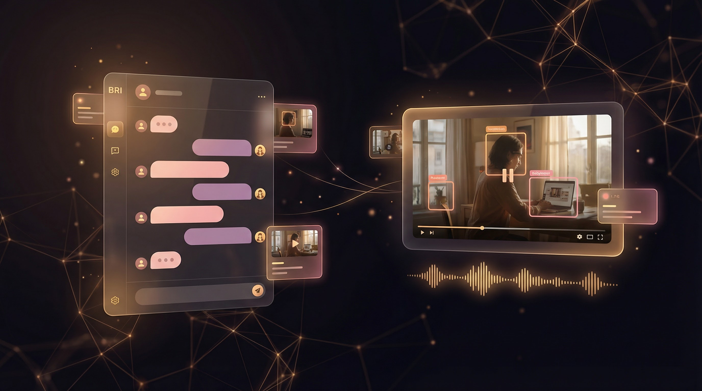

<div align="center">


# BRI (Brianna)

### Your Empathetic Video Analysis Agent

**Upload a video. Ask anything. BRI watches, listens, detects objects, and remembers your conversation — like discussing content with a brilliant friend.**

[](LICENSE)
[](https://python.org)
[](https://streamlit.io)
[](https://groq.com)
[](https://fastapi.tiangolo.com)
[](https://docker.com)

[Features](#features) · [Quick Start](#-quick-start) · [What You Can Ask](#what-you-can-ask) · [Architecture](#architecture) · [API Reference](#api-reference) · [Contributing](#contributing)

---



</div>

---

## The Problem

Video content is exploding, but understanding what's inside a video is still painful. You have to watch the whole thing, scrub through timelines, take manual notes, and forget context between sessions. There's no way to just *ask* a video a question and get an intelligent answer.

## The Solution

BRI is an **open-source, empathetic multimodal agent** for video processing. Upload any video, and BRI extracts frames (BLIP), transcribes audio (Whisper), detects objects (YOLOv8), and wraps it all in a conversational interface powered by Groq's Llama 3.1 70B. She remembers your conversation history per video, suggests follow-up questions, and lets you click timestamps to jump to specific moments.

> *"What did they say about the deadline at around 2:30?"*
>
> BRI finds the exact transcript segment, shows the relevant frame, and remembers the context for your next question.

---

## Features

- **Video Upload and Management** — Drag-and-drop upload with library view and thumbnail previews
- **Conversational Interface** — Chat naturally about your video content with full context awareness
- **Multimodal Analysis** — Frame captioning (BLIP), audio transcription (Whisper), object detection (YOLOv8)
- **Smart Memory** — Maintains conversation history per video for seamless follow-ups
- **Intelligent Routing** — Automatically determines which processing tools to use based on your question
- **Timestamp Navigation** — Click timestamps in responses to jump to specific moments
- **Proactive Suggestions** — Get relevant follow-up questions after each response
- **Redis Caching** — Intelligent caching for fast repeated queries
- **MCP Server** — Full REST API via FastAPI for programmatic access
- **Docker Ready** — One-command deployment with Docker Compose
- **Privacy-Focused** — Local storage by default, your videos stay on your machine

---

## What You Can Ask

| Query Type | Example |
|---|---|
| **Content Questions** | "What's happening in this video?" |
| **Timestamp Queries** | "What did they say at 2:30?" |
| **Object Search** | "Show me all the cats in this video" |
| **Transcript Search** | "Find when they mentioned 'deadline'" |
| **Follow-ups** | "Tell me more about that" (BRI remembers context) |
| **Scene Analysis** | "Describe the scene at the beginning" |
| **Summary** | "Give me a summary of this video" |

---

## Design Philosophy

BRI is designed to feel like a conversation with a knowledgeable friend, not a cold analysis tool.

- **Empathetic** — Warm, supportive tone throughout every interaction
- **Accessible** — No technical knowledge required to use
- **Conversational** — Natural language in, natural language out
- **Privacy-Focused** — Local storage by default
- **Graceful** — Friendly error messages and intelligent fallback strategies

---

## Quick Start

### Docker Deployment (Recommended)

```bash
# 1. Set your API key
cp .env.example .env
nano .env  # Add your GROQ_API_KEY

# 2. Deploy with one command
./deploy_test.sh

# 3. Open http://localhost:8501
```

### Local Development

```bash
# 1. Clone and install
git clone https://github.com/Alexi5000/Bri.git
cd Bri
pip install -r requirements.txt

# 2. Configure
cp .env.example .env
# Edit .env and add your GROQ_API_KEY

# 3. Initialize database
python scripts/init_db.py

# 4. Start MCP server (Terminal 1)
python mcp_server/main.py

# 5. Start Streamlit UI (Terminal 2)
streamlit run app.py

# 6. Open http://localhost:8501
```

### Prerequisites

- Python 3.9+
- Groq API key ([Get one here](https://console.groq.com))
- Redis (optional, for caching)

---

## Architecture

BRI uses a modular, layered architecture with clear separation of concerns:

```
┌─────────────────────────────────────────┐
│         Streamlit UI Layer              │
│  (Chat, Library, Player, History)       │
└─────────────┬───────────────────────────┘
              │
┌─────────────▼───────────────────────────┐
│         Agent Layer                      │
│  (Groq Agent, Router, Memory, Context)  │
└─────────────┬───────────────────────────┘
              │
┌─────────────▼───────────────────────────┐
│         MCP Server Layer                 │
│  (FastAPI, Tool Registry, Redis Cache)  │
└─────────────┬───────────────────────────┘
              │
┌─────────────▼───────────────────────────┐
│      Video Processing Tools              │
│  (OpenCV, BLIP, Whisper, YOLO)          │
└─────────────┬───────────────────────────┘
              │
┌─────────────▼───────────────────────────┐
│         Storage Layer                    │
│  (SQLite Database, File System)         │
└──────────────────────────────────────────┘
```

---

## Tech Stack

| Layer | Technology | Purpose |
|---|---|---|
| **Frontend** | Streamlit + Custom CSS | Warm, approachable chat UI |
| **LLM** | Groq (Llama 3.1 70B) | Fast, high-quality inference |
| **Frame Analysis** | BLIP (Hugging Face) | Image captioning |
| **Audio** | OpenAI Whisper | Speech-to-text transcription |
| **Object Detection** | YOLOv8 (Ultralytics) | Real-time object detection |
| **Video Processing** | OpenCV | Frame extraction |
| **API Server** | FastAPI | MCP server with REST endpoints |
| **Caching** | Redis | Optional performance boost |
| **Database** | SQLite | Metadata, memory, and conversation history |
| **Deployment** | Docker + Docker Compose | One-command deployment |

---

## Project Structure

```
Bri/
├── app.py                 # Streamlit application entry point
├── config.py              # Configuration management
├── models/                # Data models and schemas
│   ├── memory.py          # Conversation memory models
│   ├── responses.py       # Response formatting
│   ├── tools.py           # Tool definitions
│   └── video.py           # Video metadata models
├── services/              # Core business logic
├── tools/                 # Video processing tools
├── mcp_server/            # FastAPI MCP server
│   ├── main.py            # Server entry point
│   ├── cache.py           # Redis caching layer
│   ├── registry.py        # Tool registry
│   └── validation.py      # Request validation
├── ui/                    # Streamlit UI components
├── storage/               # Database and file storage
├── scripts/               # Utility and setup scripts
├── tests/                 # Test suite
├── docs/                  # Documentation
├── Dockerfile.ui          # UI container
├── Dockerfile.mcp         # MCP server container
└── .env.example           # Environment template
```

---

## API Reference

BRI exposes a REST API through the MCP server at `http://localhost:8000`:

| Endpoint | Method | Description |
|---|---|---|
| `/` | GET | Server information |
| `/health` | GET | Health check |
| `/tools` | GET | List available tools |
| `/tools/{tool_name}/execute` | POST | Execute a processing tool |
| `/videos/{video_id}/process` | POST | Batch process video |
| `/cache/stats` | GET | Cache statistics |

Full API documentation: [MCP Server README](./mcp_server/README.md)

---

## Configuration

All configuration is managed through `.env`. See `.env.example` for the full list.

| Variable | Required | Default | Description |
|---|---|---|---|
| `GROQ_API_KEY` | Yes | — | Groq API key |
| `GROQ_MODEL` | No | `llama-3.1-70b-versatile` | LLM model |
| `REDIS_ENABLED` | No | `true` | Enable Redis caching |
| `MAX_FRAMES_PER_VIDEO` | No | `100` | Max frames to extract |
| `FRAME_EXTRACTION_INTERVAL` | No | `2.0` | Seconds between frames |
| `MAX_CONVERSATION_HISTORY` | No | `10` | Messages to keep in context |
| `MCP_SERVER_PORT` | No | `8000` | MCP server port |

---

## Documentation

| Document | Description |
|---|---|
| [User Guide](./docs/USER_GUIDE.md) | Complete guide to using BRI |
| [Quick Start](./QUICK_START.md) | Get started in 5 minutes |
| [Configuration Reference](./docs/CONFIGURATION.md) | All settings explained |
| [MCP Server API](./mcp_server/README.md) | API endpoints and tool docs |
| [API Examples](./docs/API_EXAMPLES.md) | Practical code examples |
| [Troubleshooting](./docs/TROUBLESHOOTING.md) | Common issues and solutions |
| [Deployment Guide](./DEPLOYMENT_README.md) | Production deployment |
| [Architecture](./ARCHITECTURE_SUMMARY.md) | System design overview |

---

## Troubleshooting

| Issue | Quick Fix |
|---|---|
| Missing API key | Copy `.env.example` to `.env` and add your Groq API key |
| Connection refused | Ensure both MCP server and Streamlit are running |
| Redis errors | Set `REDIS_ENABLED=false` in `.env` (Redis is optional) |
| Slow processing | Reduce `MAX_FRAMES_PER_VIDEO` in `.env` |
| Out of memory | Reduce `MAX_FRAMES_PER_VIDEO` and `LAZY_LOAD_BATCH_SIZE` |

Full troubleshooting guide: [docs/TROUBLESHOOTING.md](./docs/TROUBLESHOOTING.md)

---

## Roadmap

- [ ] Multi-video comparison ("Compare these two videos")
- [ ] Real-time video stream analysis
- [ ] Custom model fine-tuning for domain-specific content
- [ ] Collaborative video annotation
- [ ] Export analysis reports (PDF, Markdown)
- [ ] Plugin system for custom processing tools
- [ ] Multi-language transcription support

---

## Contributing

We welcome contributions! See the full guide below:

1. Fork the repository
2. Create a feature branch: `git checkout -b feature/your-feature`
3. Make your changes and write tests
4. Run tests: `pytest`
5. Commit: `git commit -m "feat: add your feature"`
6. Push and open a Pull Request

---

## Acknowledgments

BRI is built with amazing open-source technologies: [Groq](https://groq.com), [OpenCV](https://opencv.org), [Hugging Face BLIP](https://huggingface.co), [OpenAI Whisper](https://github.com/openai/whisper), [Ultralytics YOLOv8](https://ultralytics.com), [Streamlit](https://streamlit.io), and [FastAPI](https://fastapi.tiangolo.com).

---

## License

MIT — see [LICENSE](./LICENSE) for details.

---

<div align="center">

**Built by [Alex Cinovoj](https://github.com/Alexi5000) · [TechTide AI](https://github.com/Alexi5000)**

*Ask. Understand. Remember.*

</div>
