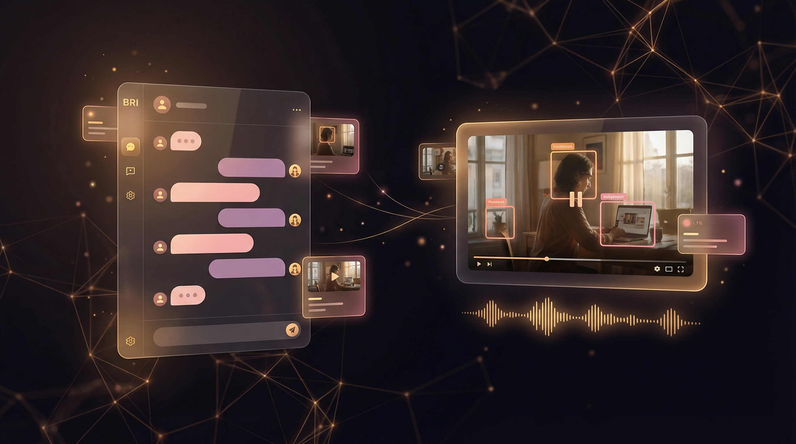
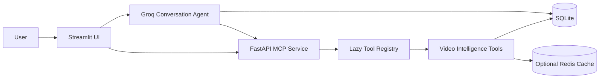

<div align="center">
  

# BRI — Empathetic Video Intelligence

### Conversational video analysis with a FastAPI MCP service, Streamlit interface, SQLite persistence, and optional multimodal ML tools.

[](https://python.org)
[](https://fastapi.tiangolo.com)
[](https://streamlit.io)
[](https://sqlite.org)
[](https://docker.com)
[](LICENSE)

</div>



**BRI**, short for **Brianna**, turns uploaded videos into a structured, searchable, and conversational knowledge layer. It extracts representative frames, captions visual scenes, transcribes speech, detects objects, stores timestamped context, and answers natural-language questions about the media through a production-ready Python application.

## What BRI includes

BRI is organized as a complete application rather than a standalone demo. The repository includes a Streamlit user experience, a FastAPI MCP-style service, SQLite storage, Docker Compose orchestration, validation scripts, contract tests, operational documentation, and optional AI/media integrations for full local multimodal processing.

| Area | Production capability |
|---|---|
| **User interface** | Streamlit upload, video library, playback, chat workflow, contextual status messaging, and local operator-friendly controls. |
| **MCP API** | FastAPI health checks, standardized response envelopes, version-aware endpoints, request validation, rate limiting, cache hooks, and tool execution routes. |
| **Video tools** | Public catalog for `extract_frames`, `caption_frames`, `transcribe_audio`, and `detect_objects`; heavy ML packages are loaded lazily only when a tool executes. |
| **Data layer** | SQLite-backed video metadata, context records, conversation history, schema initialization, backup guidance, and storage contract tests. |
| **Operations** | Docker startup, environment templates, smoke checks, production validation, CI workflow, troubleshooting guidance, and runbook documentation. |

## Architecture


```mermaid
flowchart LR
    User[User] --> UI[Streamlit UI]
    UI --> API[FastAPI MCP Service]
    API --> Registry[Lazy Tool Registry]
    Registry --> Tools[Video Intelligence Tools]
    Tools --> DB[(SQLite)]
    Tools --> Cache[(Optional Redis Cache)]
    UI --> Agent[Groq Conversation Agent]
    Agent --> DB
    Agent --> API
```

The application keeps lightweight API startup separate from optional model execution. Tool discovery is available in lean CI and API-only environments, while BLIP, Whisper, YOLOv8, ChromaDB, and sentence-transformer dependencies can be installed for full local media processing.

## Quick start

The fastest production-like path is Docker Compose. Copy the environment template, add a Groq key if you want live conversational responses, and start the stack.

```bash
git clone https://github.com/Alexi5000/Bri.git
cd Bri
cp .env.example .env
# Optional: add GROQ_API_KEY to .env for live AI responses.
docker compose up --build
```

Open the Streamlit application at `http://localhost:8501` and the FastAPI service at `http://localhost:8000`.

For local Python development, create an isolated environment and install the package in editable mode. The base installation is intentionally test-friendly; install the `ai` extra only when local multimodal model execution is required.

```bash
python -m venv .venv
source .venv/bin/activate
pip install -e .[dev]
python scripts/init_db.py
uvicorn mcp_server.main:app --reload --port 8000
streamlit run app.py
```

## Core commands

| Command | Purpose |
|---|---|
| `python3 -m pytest tests/production -q` | Runs the deterministic production contract suite. |
| `python3 scripts/smoke_api.py` | Smoke-tests the FastAPI app in-process without requiring a live server. |
| `python3 scripts/smoke_api.py --url http://localhost:8000` | Smoke-tests a running deployment. |
| `python3 scripts/validate_production.py` | Runs repository-level production-readiness checks. |
| `scripts/deployment/preflight_check.sh` | Runs the legacy deployment preflight helper from its structured scripts location. |
| `docker compose up --build` | Starts the API, UI, Redis service, and shared application volumes. |
| `pip install -e .[ai,dev]` | Installs development tools plus optional local AI/media dependencies. |

## API surface

BRI’s FastAPI service exposes a standardized JSON envelope for production clients. Tool discovery stays available even when optional model dependencies are not installed, which keeps CI, documentation checks, and API health checks deterministic.

| Endpoint | Description |
|---|---|
| `GET /health` | Returns service health, dependency status, version, and operational metadata. |
| `GET /tools` and `GET /v1/tools` | Lists registered MCP-style video tools and their JSON schemas. |
| `POST /tools/{tool_name}/execute` | Executes a validated video tool request. |
| `POST /videos/{video_id}/process` | Runs a processing plan for one stored video. |
| `POST /videos/{video_id}/process-progressive` | Starts staged video processing with progress tracking. |
| `GET /videos/{video_id}/status` | Reads stored processing state and context availability. |

## Documentation map

The most useful production documents are linked below. Additional historical implementation notes remain available in `docs/` for auditability.

| Guide | Link |
|---|---|
| **Documentation index** | [docs/INDEX.md](docs/INDEX.md) |
| **Quickstart** | [docs/QUICKSTART.md](docs/QUICKSTART.md) |
| **Architecture** | [docs/ARCHITECTURE.md](docs/ARCHITECTURE.md) |
| **API reference** | [docs/API.md](docs/API.md) |
| **API examples** | [docs/API_EXAMPLES.md](docs/API_EXAMPLES.md) |
| **Configuration** | [docs/CONFIGURATION.md](docs/CONFIGURATION.md) |
| **Deployment** | [docs/DEPLOYMENT.md](docs/DEPLOYMENT.md) |
| **Testing** | [docs/TESTING.md](docs/TESTING.md) |
| **Operations runbook** | [docs/OPERATIONS_RUNBOOK.md](docs/OPERATIONS_RUNBOOK.md) |
| **Troubleshooting** | [docs/TROUBLESHOOTING.md](docs/TROUBLESHOOTING.md) |

## Configuration

Runtime settings are read from environment variables and `.env` files. Start from `.env.example`, keep secrets out of source control, and set `GROQ_API_KEY` when live LLM-backed answers are needed. Test and CI paths can run without a Groq key by setting `APP_ENV=test` and `ALLOW_MISSING_GROQ_FOR_TESTS=true`.

| Variable | Purpose |
|---|---|
| `APP_ENV` | Selects runtime mode such as `development`, `test`, or `production`. |
| `GROQ_API_KEY` | Enables live conversational AI responses. |
| `DATABASE_PATH` | Controls the SQLite database location. |
| `VIDEO_STORAGE_PATH` | Stores uploaded video files. |
| `FRAME_STORAGE_PATH` | Stores extracted frame images. |
| `REDIS_ENABLED` | Enables optional Redis-backed cache behavior when configured. |

## Enterprise repository layout

BRI’s root is kept intentionally small for production operators. The root contains only the public README, core Python entry points, package metadata, Docker files, committed product graphics, and the main application packages. Historical build reports were moved to `docs/archive/root-history/`, legacy helper scripts were moved to `scripts/deployment/` or `scripts/archive/`, and AI-contributor guidance from the former side branch was preserved at `docs/ai/CLAUDE.md`.

| Path | Purpose |
|---|---|
| `mcp_server/`, `services/`, `tools/`, `storage/`, `models/`, `utils/`, `ui/` | Runtime application packages. |
| `scripts/` | Smoke tests, validation, initialization, deployment helpers, and archived one-off utilities. |
| `tests/` | Production, integration, and unit test coverage. |
| `docs/` | Enterprise documentation, runbooks, API guides, and historical archives. |
| `assets/` | Preserved README graphics and public product identity assets. |

## Repository hygiene

Generated media, logs, databases, Python caches, virtual environments, local environment files, `.kiro`, `.devcontainer`, `.streamlit`, and other runtime or workspace artifacts are excluded from source control. The remote repository is consolidated to the single production branch, `master`, and the committed graphics under `assets/` are intentionally preserved because they define the public identity of the project.

## License

BRI is released under the [MIT License](LICENSE).
