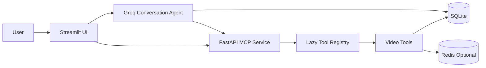

<div align="center">
  

# BRI — Empathetic Video Intelligence

### Production-ready conversational video analysis with FastAPI MCP tooling, Streamlit UX, SQLite persistence, and optional multimodal ML pipelines.

[](https://python.org)
[](https://streamlit.io)
[](https://fastapi.tiangolo.com)
[](https://groq.com)
[](https://docker.com)
[](LICENSE)

</div>


**BRI**, short for **Brianna**, turns uploaded videos into a searchable and conversational knowledge layer. The application extracts frames, captions visual scenes, transcribes audio, detects objects, stores structured context, and answers natural-language questions with timestamp-aware evidence.

## Production scope

BRI is built as a complete Python application for deployable video intelligence workflows. It includes a Streamlit user interface, a FastAPI MCP-style service, SQLite storage, Docker Compose orchestration, hardened configuration, contract tests, validation scripts, and optional heavy ML integrations for teams that want local multimodal processing.

| Layer | Production capability |
|---|---|
| **User experience** | Streamlit upload, video library, chat workflow, contextual responses, and operational feedback. |
| **API service** | FastAPI health checks, versioned response envelopes, validated request models, rate limiting, caching hooks, and tool execution endpoints. |
| **Video intelligence** | Public tool catalog for `extract_frames`, `caption_frames`, `transcribe_audio`, and `detect_objects`, with optional BLIP, Whisper, and YOLOv8 execution paths. |
| **Persistence** | SQLite-backed video records, context storage, migrations, backup and restore scripts, and database contract tests. |
| **Operations** | Docker startup, smoke checks, production validation, runbooks, configuration guidance, and deterministic CI-safe test boundaries. |

## Architecture


```mermaid
flowchart LR
    User[User] --> UI[Streamlit UI]
    UI --> API[FastAPI MCP Service]
    API --> Registry[Lazy Tool Registry]
    Registry --> Tools[Video Tools]
    Tools --> DB[(SQLite)]
    Tools --> Cache[(Redis Optional)]
    UI --> Agent[Groq Conversation Agent]
    Agent --> DB
    Agent --> API
```

## Quick start

The fastest production-like path is Docker Compose. Copy the environment template, add a Groq key if you want live conversational responses, and start the stack.

```bash
git clone https://github.com/Alexi5000/Bri.git
cd Bri
cp .env.example .env
# Optional: add GROQ_API_KEY to .env for live AI responses.
docker compose up --build
```

Open the Streamlit application at `http://localhost:8501` and the FastAPI service at `http://localhost:8000`.

For local Python development, create an isolated environment and install the editable package. The base install is intentionally CI-friendly; install `.[ai]` only when you want the optional BLIP, Whisper, YOLOv8, ChromaDB, and sentence-transformer stack.

```bash
python -m venv .venv
source .venv/bin/activate
pip install -e .[dev]
python scripts/init_db.py
uvicorn mcp_server.main:app --reload --port 8000
streamlit run app.py
```

## Core commands

| Command | Purpose |
|---|---|
| `python3 -m pytest tests/production -q` | Runs the production contract suite for configuration, API, storage, and service boundaries. |
| `python3 scripts/validate_production.py` | Executes the repository’s production-readiness validation checks. |
| `python3 scripts/smoke_api.py --url http://localhost:8000` | Smoke-tests a running FastAPI service. |
| `docker compose up --build` | Starts the UI, API, Redis, and shared application volumes. |
| `pip install -e .[ai,dev]` | Installs development tooling plus optional local ML dependencies for full media processing. |

## API surface

BRI’s FastAPI service returns standardized production envelopes for tool discovery and execution. The public catalog remains visible even when optional ML dependencies are not installed; heavy packages are loaded lazily only when a corresponding tool is executed.

| Endpoint | Description |
|---|---|
| `GET /health` | Returns service health, dependency status, version, and operational metadata. |
| `GET /tools` and `GET /v1/tools` | Lists registered MCP-style video tools and JSON schemas. |
| `POST /tools/{tool_name}/execute` | Executes a validated video tool request. |
| `POST /videos/{video_id}/process` | Runs a processing plan for one video. |
| `POST /videos/{video_id}/process-progressive` | Starts staged processing with progress tracking. |
| `GET /videos/{video_id}/status` | Inspects stored video context and processing status. |

## Documentation map

| Guide | Link |
|---|---|
| **Architecture** | [docs/ARCHITECTURE.md](docs/ARCHITECTURE.md) |
| **API reference** | [docs/API.md](docs/API.md) |
| **API examples** | [docs/API_EXAMPLES.md](docs/API_EXAMPLES.md) |
| **Setup and configuration** | [docs/CONFIGURATION.md](docs/CONFIGURATION.md) |
| **Deployment** | [docs/DEPLOYMENT.md](docs/DEPLOYMENT.md) |
| **Testing** | [docs/TESTING.md](docs/TESTING.md) |
| **Operations runbook** | [docs/OPERATIONS_RUNBOOK.md](docs/OPERATIONS_RUNBOOK.md) |
| **Troubleshooting** | [docs/TROUBLESHOOTING.md](docs/TROUBLESHOOTING.md) |

## Repository hygiene

Generated media, logs, databases, Python caches, virtual environments, and secret-bearing environment files are excluded from source control. The committed graphics under `assets/` are intentionally preserved because they define the public identity of the project.

## License

BRI is released under the [MIT License](LICENSE).
