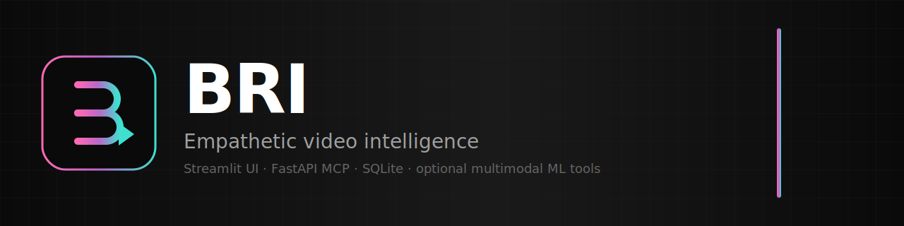
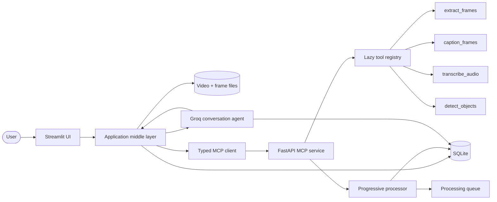

<div align="center">
  

# BRI — Conversational video intelligence that feels human

### Empathetic multimodal video analysis: upload, watch, ask, remember.

[](https://github.com/Alexi5000/Bri/actions)
[](LICENSE)
[](https://python.org)
[](https://fastapi.tiangolo.com)
[](https://streamlit.io)
[](https://sqlite.org)
[](https://docker.com)
[](https://github.com/Alexi5000/Bri/pkgs/container/bri-mcp)

</div>



BRI (Brianna) is an open-source multimodal video intelligence agent. It extracts frames, captions scenes, transcribes speech, and detects objects through a FastAPI MCP service and a Streamlit interface, then answers natural-language questions about the media using a Groq-backed conversational agent with per-video memory. It is designed for teams that want to ship a real product on top of open weights rather than wire a notebook to a vector store every time.

## Hero

```text
                ┌──────────────────────────────────────────────────┐
                │                   Streamlit UI                    │
                │  welcome · library · player · chat · history      │
                └────────────────────────┬─────────────────────────┘
                                         │
                ┌────────────────────────▼─────────────────────────┐
                │              Application middle layer             │
                │   upload · delete · chat · progress · health     │
                └──────────┬───────────────────────────┬───────────┘
                           │                           │
                  ┌────────▼─────────┐         ┌───────▼────────┐
                  │  SQLite + files  │         │   MCP client   │
                  └──────────────────┘         └───────┬────────┘
                                                      │
                          ┌───────────────────────────▼───────────┐
                          │            FastAPI MCP service         │
                          │  /health  /tools  /videos/{id}/...     │
                          └───────────────────────────┬───────────┘
                                                      │
                  ┌──────────┬────────────┬────────────┼───────────┬──────────┐
                  ▼          ▼            ▼            ▼           ▼          ▼
              extract_    caption_    transcribe_   detect_    progressive  circuit
              frames      frames      audio         objects    processor    breaker
```

## 30-second quickstart

```bash
git clone https://github.com/Alexi5000/Bri.git
cd Bri
cp .env.example .env          # add GROQ_API_KEY for live conversational responses
docker compose up --build
```

Open the Streamlit application at `http://localhost:8501` and the FastAPI service at `http://localhost:8000`. Upload a video on the welcome screen and ask the chat panel a question about it.

## 5-minute tutorial

```bash
# 1. Install the package and dev extras into a fresh virtualenv.
python -m venv .venv && source .venv/bin/activate
pip install -e .[dev]

# 2. Initialize the local SQLite database and runtime directories.
python scripts/init_db.py

# 3. Start the MCP server (terminal A).
uvicorn mcp_server.main:app --reload --port 8000

# 4. Start the Streamlit UI (terminal B).
streamlit run app.py
```

Upload a short clip on the welcome screen. BRI extracts representative frames, captions each, transcribes audio, and detects objects. Then ask the chat panel a question such as "what is the speaker holding at 0:15?" and watch the tool chain run end to end.

If you want to opt into the full local multimodal pipeline (BLIP captioning, Whisper transcription, YOLOv8 detection), install the `ai` extra:

```bash
pip install -e .[ai,dev]
```

## Architecture


```mermaid
flowchart LR
  User([User]) --> UI[Streamlit UI]
  UI --> Middle[Application middle layer]
  Middle --> DB[(SQLite)]
  Middle --> Store[(Video + frame files)]
  Middle --> Client[Typed MCP client]
  Client --> API[FastAPI MCP service]
  API --> Registry[Lazy tool registry]
  Registry --> Frames[extract_frames]
  Registry --> Captions[caption_frames]
  Registry --> Audio[transcribe_audio]
  Registry --> Objects[detect_objects]
  API --> Processor[Progressive processor]
  Processor --> Queue[Processing queue]
  Processor --> DB
  Middle --> Agent[Groq conversation agent]
  Agent --> DB
  Agent --> Middle
```

The middle layer is the single source of truth for upload, delete, chat, health, progress, and persistence readiness. The UI never speaks SQL or HTTP directly; the API never speaks Streamlit. Tool discovery is wired in lean CI, while BLIP, Whisper, YOLOv8, and sentence-transformers are loaded lazily only when a tool actually executes.

## API surface

| Endpoint | Kind | Description |
|---|---|---|
| `GET /health` | HTTP | Liveness probe, dependency status, version, and operational metadata. |
| `GET /tools` | HTTP | Lists registered MCP-style video tools and their JSON schemas. |
| `GET /v1/tools` | HTTP | Versioned variant of `/tools`. |
| `POST /tools/{tool_name}/execute` | HTTP | Executes a validated video tool request. |
| `POST /videos/{video_id}/process` | HTTP | Runs the standard processing plan for one stored video. |
| `POST /videos/{video_id}/process-progressive` | HTTP | Starts staged processing with progress tracking. |
| `GET /videos/{video_id}/status` | HTTP | Reads stored processing state and context availability. |
| `bri-video-agent` | CLI | Console entry point installed by `pip install bri-video-agent`. |

## Configuration

| Variable | Default | Effect |
|---|---|---|
| `APP_ENV` | `development` | Selects runtime mode (`development`, `test`, `production`). |
| `GROQ_API_KEY` | _unset_ | Enables live conversational AI responses. |
| `DATABASE_PATH` | `data/bri.db` | SQLite database location. |
| `VIDEO_STORAGE_PATH` | `data/videos` | Where uploaded videos are stored. |
| `FRAME_STORAGE_PATH` | `data/frames` | Where extracted frame images are stored. |
| `MCP_SERVER_HOST` | `localhost` | MCP service host. |
| `MCP_SERVER_PORT` | `8000` | MCP service port. |
| `REDIS_ENABLED` | `false` | Enables optional Redis-backed caching when configured. |
| `MAX_FRAMES_PER_VIDEO` | `20` | Caps frame extraction per video (lower for speed). |
| `TOOL_EXECUTION_TIMEOUT` | `60` | Per-tool timeout in seconds. |

See [`.env.example`](.env.example) for the full list. The defaults are test-friendly; set `APP_ENV=production` and provide `GROQ_API_KEY` for live responses.

## Contributing

See [CONTRIBUTING.md](CONTRIBUTING.md) for environment setup, branch naming, commit message format, and review SLA. Bug reports and feature requests go through the issue templates under `.github/ISSUE_TEMPLATE/`.

## License

Released under the [MIT License](LICENSE).