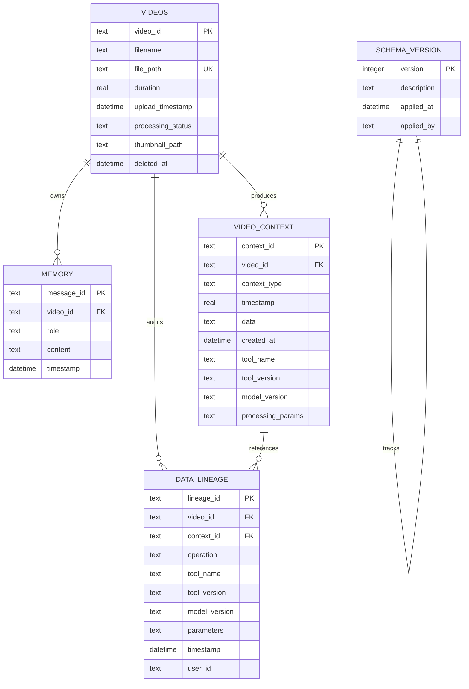
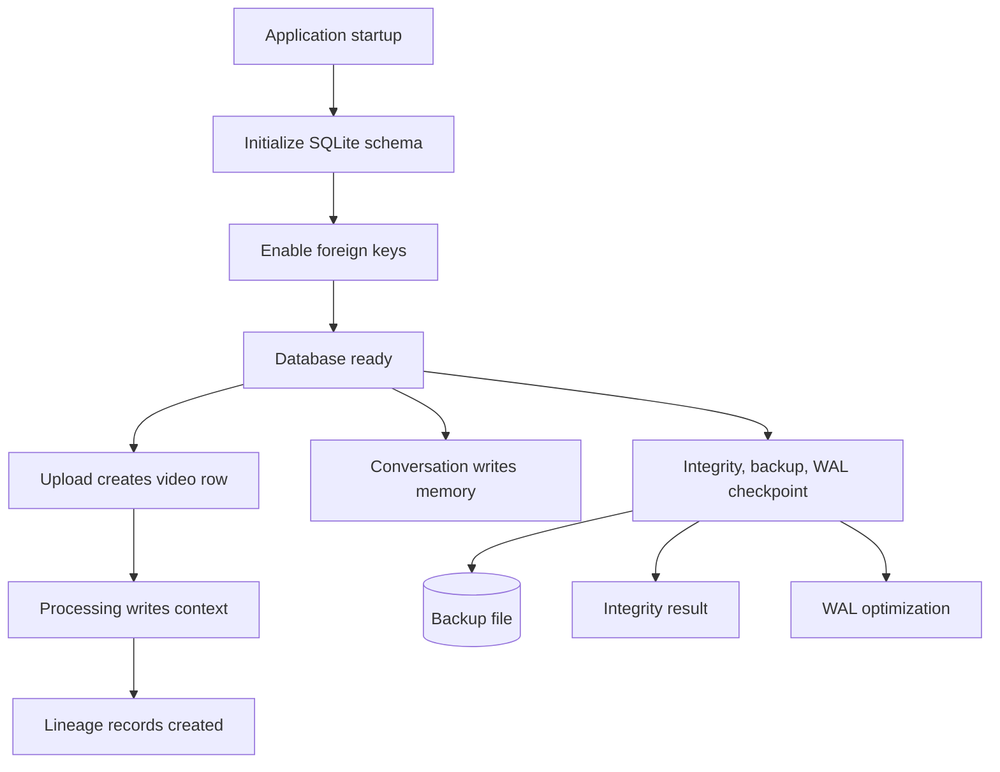
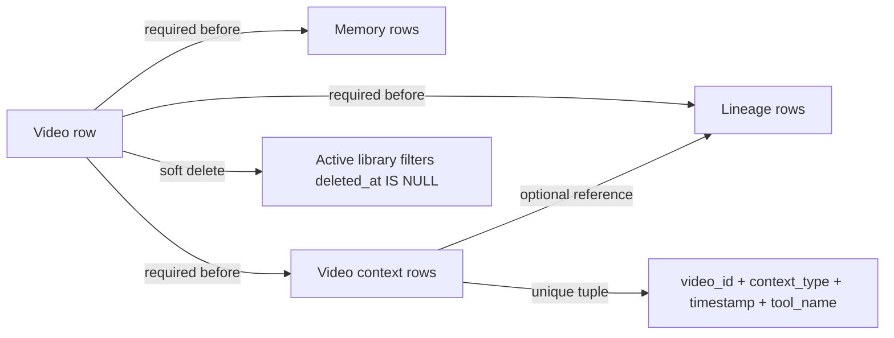

# BRI Database Schema and Durability Guide

BRI uses SQLite as the durable local persistence layer for video metadata, conversation memory, extracted intelligence context, lineage records, and schema version tracking. The production posture treats SQLite as a real application database: schema constraints protect data quality, indexes support the common access paths, foreign keys preserve referential integrity, and maintenance helpers provide integrity checks, online backups, WAL optimization, and safe vacuum operations.

> **Persistence standard:** Every durable fact that the user may expect to survive a restart belongs in SQLite or the managed file store. Streamlit session state is presentation state only and must not be treated as the system of record.

## Entity relationship diagram

## Table responsibilities

| Table | Responsibility | Key constraints | Primary access paths |
|---|---|---|---|
| `videos` | Stores uploaded video metadata, processing status, thumbnail path, and soft-delete state. | `video_id` primary key, unique `file_path`, non-empty filename/path, positive duration, controlled status enum. | Library listing, selected-video context, processing status dashboards. |
| `memory` | Stores user and assistant conversation turns for a video. | Foreign key to `videos`, role enum, non-empty content. | Chat history rendering and context-aware response generation. |
| `video_context` | Stores processed intelligence artifacts such as frames, captions, transcripts, objects, metadata, and idempotency markers. | Foreign key to `videos`, context-type enum, non-negative timestamp, non-empty data, unique video/type/timestamp/tool tuple. | Context retrieval, semantic search inputs, multimodal grounding. |
| `data_lineage` | Tracks create, update, delete, and reprocess operations for auditability. | Foreign keys to `videos` and optional `video_context`, controlled operation enum. | Debugging, data-quality audits, recovery analysis. |
| `schema_version` | Records applied schema version metadata. | Integer primary key and description. | Startup verification and operational inspection. |

## Index strategy

| Index | Purpose |
|---|---|
| `idx_memory_video_id` and `idx_memory_video_timestamp` | Fast retrieval of conversation history by video in chronological or reverse-chronological order. |
| `idx_video_context_video_id`, `idx_video_context_lookup`, and `idx_video_context_type_timestamp` | Efficient lookup of multimodal context by video, context type, and timestamp. |
| `idx_videos_processing_status` and `idx_videos_active` | Fast command-center metrics and active-library filtering. |
| `idx_data_lineage_video` and `idx_data_lineage_context` | Efficient lineage audits by video or generated context record. |

## Persistence lifecycle

## Durability controls

| Control | Implementation | Operational outcome |
|---|---|---|
| Foreign-key enforcement | Database connection initialization enables referential integrity checks. | Orphaned memory and context records are rejected. |
| Transaction wrapper | Database helper transaction boundaries commit success and roll back failure. | Partial writes do not become durable after exceptions. |
| Reentrant connection lock | Shared database connection access is guarded per instance. | Streamlit reruns, API calls, and background workers avoid connection lifecycle races. |
| Singleton lock | Global database instance creation is guarded. | Concurrent startup paths do not create conflicting connection managers. |
| Online backup helper | `storage/maintenance.py` uses SQLite backup capabilities. | Operators can create backups while the database remains available. |
| Integrity checks | Maintenance helper runs SQLite integrity validation. | Corruption is detectable before continuing normal operations. |
| WAL optimization | Maintenance helper can checkpoint WAL state. | Long-running local deployments can keep database files tidy and predictable. |
| Safe vacuum | Maintenance helper exposes vacuum through an explicit operation. | Storage compaction is available as an intentional maintenance action. |

## Schema invariants

| Invariant | Why it matters | Enforcement |
|---|---|---|
| Every conversation turn belongs to exactly one video. | Chat answers must be grounded in a selected artifact. | `memory.video_id` foreign key. |
| Every context artifact belongs to exactly one video. | Multimodal intelligence must be traceable. | `video_context.video_id` foreign key. |
| Processing status is explicit. | UI readiness and retry behavior depend on predictable states. | `processing_status` check constraint. |
| Context timestamps are non-negative when present. | Timeline rendering and search ranking rely on valid offsets. | `timestamp IS NULL OR timestamp >= 0`. |
| File paths are unique. | Duplicate uploads should not create ambiguous durable references. | `videos.file_path` unique constraint. |
| Active library excludes soft-deleted rows. | User-facing library must not show deleted artifacts. | Soft-delete query discipline and `idx_videos_active`. |

## Backup and restore expectations

BRI’s SQLite maintenance layer follows SQLite’s online backup approach, which is designed to copy a live database safely through the database engine instead of naïvely copying partially written files.[1] Operators should prefer the application’s maintenance helper or documented backup command over manual file copies when the app is running.

| Operation | Recommended trigger | Expected result |
|---|---|---|
| Integrity check | Before release, before backup, and during incident response. | A pass/fail result that can be surfaced in the Streamlit command center. |
| Online backup | Before upgrades, before destructive maintenance, and on operator schedule. | Timestamped database backup under the configured backup directory. |
| WAL checkpoint | After high-volume processing or before archival backup. | Reduced WAL growth and cleaner on-disk database state. |
| Vacuum | After significant delete/reprocess cycles. | Reclaimed storage after an explicit operator action. |

## References

[1]: https://sqlite.org/backup.html "SQLite online backup API documentation"
