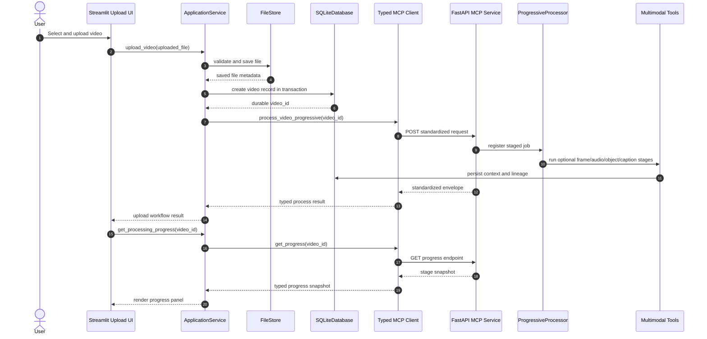
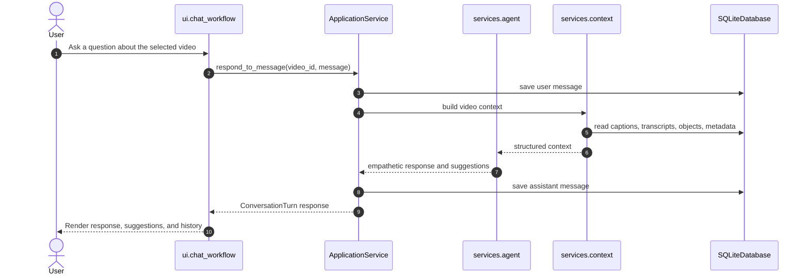
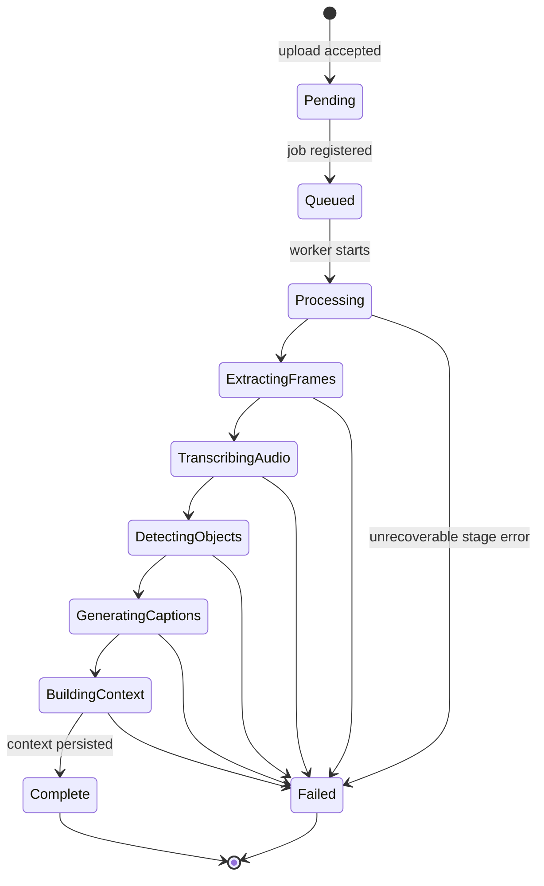
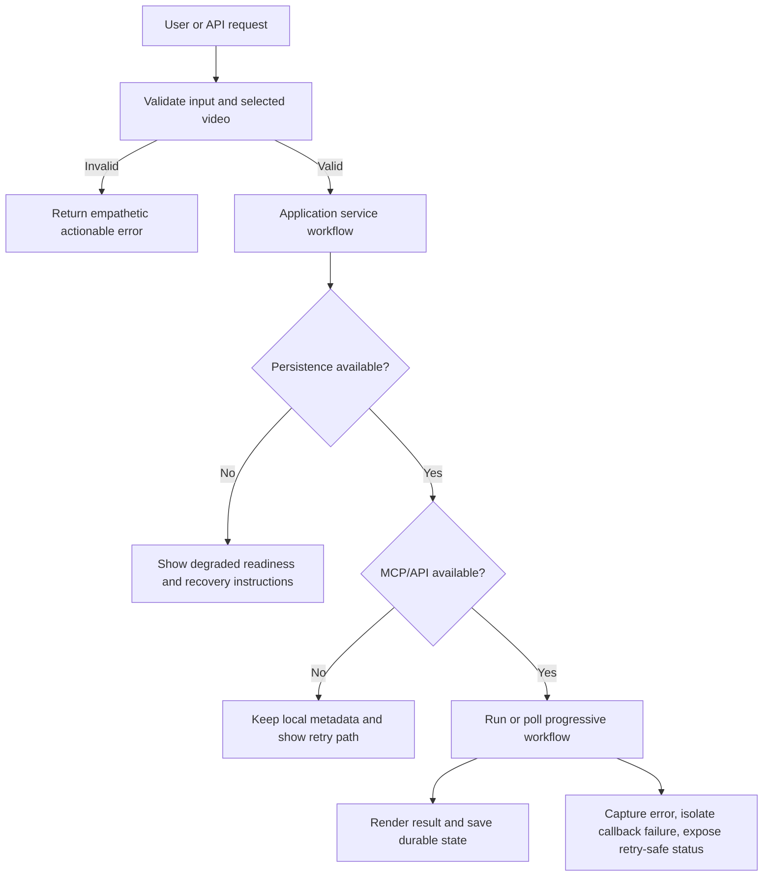

# BRI Production Data Flow and State Model

BRI is a full-stack **empathetic video intelligence** application. Its runtime flow begins in Streamlit, passes through a Python middle layer, persists durable facts in SQLite, and calls the FastAPI MCP service for tool discovery and progressive video-intelligence workflows. The architecture is intentionally designed so each layer owns exactly one kind of state: Streamlit owns presentation state, the application service owns workflow state, the MCP client owns transport normalization, processing services own job state, and SQLite owns durable records.

## System data-flow summary

| Flow | Entry point | Middle-layer boundary | Durable state | Observable UI feedback |
|---|---|---|---|---|
| Upload video | `ui/welcome.py` | `ApplicationService.upload_video()` | `videos`, file store metadata, staged processing artifacts | Upload validation, save result, processing kickoff, progress panel. |
| Discover tools | Streamlit shell and smoke tests | `ApplicationService.get_readiness_snapshot()` and `MCPClient.list_tools()` | None required; optional health cache only | MCP health, public tool catalog, readiness indicators. |
| Process video | FastAPI `/tools/process_video_progressive` | `MCPClient.process_video_progressive()` | `video_context`, `data_lineage`, optional generated artifacts | Stage progress, completion state, failures with remediation text. |
| Poll progress | Chat and selected-video view | `ApplicationService.get_processing_progress()` | In-memory processor snapshot plus persisted contexts | Progress percent, active stage, available intelligence outputs. |
| Converse | `ui/chat_workflow.py` | `ApplicationService.respond_to_message()` | `memory` conversation history | Empathetic assistant response, citations to observed moments, suggestions. |
| Manage library | `ui/library.py` | `ApplicationService.list_videos()` and `delete_video()` | Soft-deleted `videos`, file lifecycle cleanup | Filtered video cards, safe delete result, refreshed counts. |
| Maintain database | Command center shell | `ApplicationService.get_persistence_readiness()` | SQLite integrity, WAL, backup metadata | Integrity, backup readiness, and maintenance status. |

## Upload and processing sequence

## Conversation sequence

## Processing state machine

## State ownership contract

| State category | Owner | Write path | Read path | Race-safety control |
|---|---|---|---|---|
| Widget and page state | Streamlit session state | `app.py` and focused UI modules | UI modules only | Streamlit rerun semantics; no durable writes in raw UI helpers. |
| Workflow state | `ApplicationService` | Explicit service methods | UI calls service facade | Centralized orchestration prevents duplicate direct writes. |
| MCP transport state | `MCPClient` | HTTP requests and response-envelope normalization | Application service only | Timeouts and typed result wrappers. |
| Processing progress | `ProgressiveProcessor` and `ProcessingQueue` | Worker stages and queue transitions | API progress endpoint and middle layer | Lock-protected dictionaries, duplicate guards, and immutable snapshot returns. |
| Durable video metadata | SQLite `videos` table | Database helper transactions | Application service and context builders | Reentrant connection lock, foreign keys, constraints, indexes. |
| Durable conversation memory | SQLite `memory` table | Application service and agent workflow | Chat workflow through service facade | Transactional inserts and video foreign keys. |
| Durable intelligence context | SQLite `video_context` and `data_lineage` | Tool execution and processing stages | Context service, search, and chat | Unique context constraints and lineage audit records. |
| File artifacts | `FileStore` | Application upload/delete workflows | Application service and UI display paths | Validated file paths and delete workflow centralization. |

## Error and recovery flow

## Production invariants

| Invariant | Enforcement point |
|---|---|
| A video must have a non-empty file path and positive duration. | `storage/schema.sql` table checks and file-store validation. |
| Conversation memory must belong to a valid video. | `memory.video_id` foreign key. |
| Video context cannot duplicate the same video/type/timestamp/tool tuple. | `video_context` unique constraint. |
| Deleted videos should not appear in active library views. | Soft-delete field plus database query filters. |
| UI must not call MCP HTTP endpoints directly. | Streamlit pages call `ApplicationService`, which calls `MCPClient`. |
| Processing progress reads must be snapshots, not shared mutable dictionaries. | Progressive processor and queue snapshot locks. |

## References

[1]: https://docs.streamlit.io/develop/concepts/architecture/architecture "Streamlit architecture documentation"
[2]: https://fastapi.tiangolo.com/tutorial/bigger-applications/ "FastAPI bigger applications documentation"
[3]: https://sqlite.org/backup.html "SQLite online backup API documentation"
