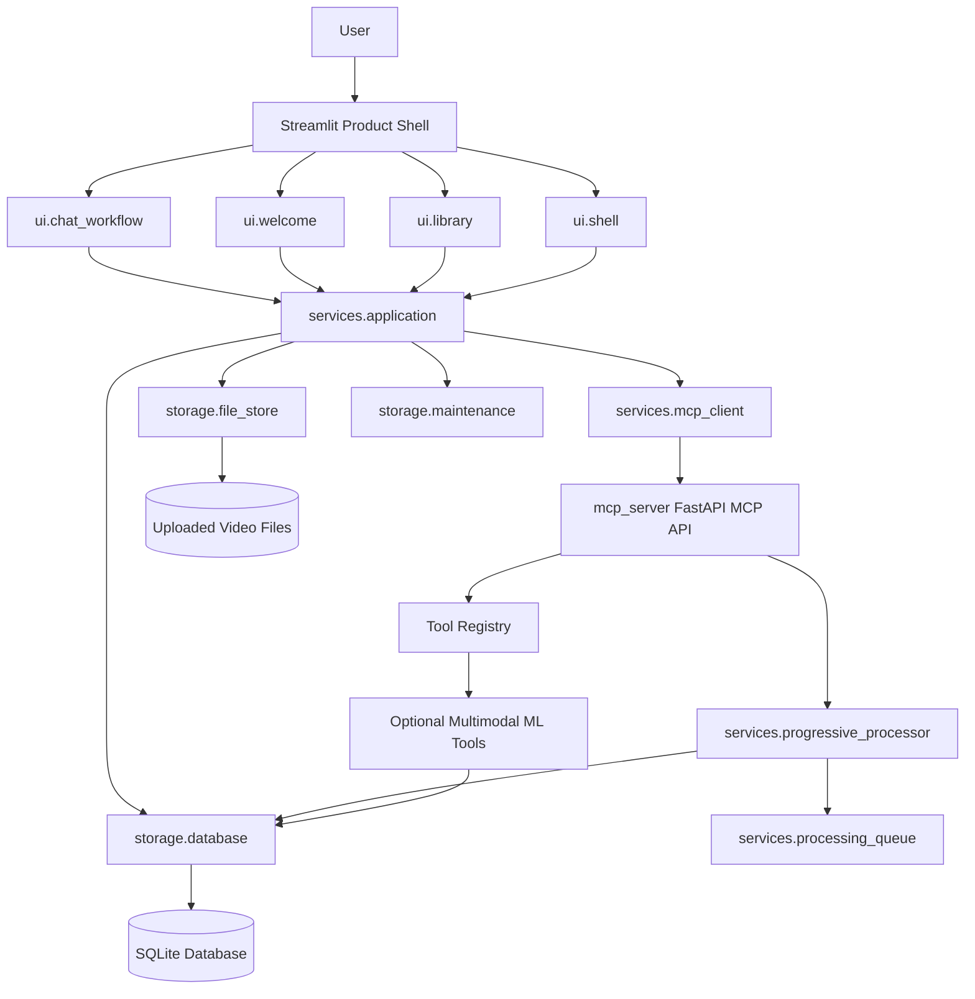
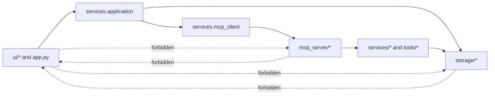

# BRI Uncle Bob Clean-Code Architecture Review

BRI’s production architecture is organized around **small, explicit responsibility boundaries** rather than a single monolithic Streamlit script or backend god object. The current clean-code pass establishes the Streamlit entry point as a composition root, the application service as the middle-layer orchestration boundary, the MCP client as a typed remote-contract adapter, and SQLite as a durable persistence boundary. This separation follows the Clean Architecture principle that policies should be independent of UI, framework, database, and external agency details, while still keeping the implementation pragmatic for a Python full-stack app.

> **Clean-code target:** A maintainer should be able to change the Streamlit presentation, MCP HTTP contract, persistence strategy, or optional multimodal tool execution without rewriting unrelated layers.

## Responsibility map

| Layer | Primary modules | Responsibility | Explicit non-responsibility |
|---|---|---|---|
| Product shell | `app.py`, `ui/shell.py`, `ui/chat_workflow.py`, `ui/welcome.py`, `ui/library.py` | Render Streamlit pages, collect user intent, display readiness and progress, and delegate workflows. | Direct SQL, file lifecycle orchestration, direct HTTP calls, or mutable processing state ownership. |
| Application middle layer | `services/application.py` | Coordinate upload, library, chat, persistence readiness, MCP health, progress, and typed workflow outcomes. | Widget rendering, raw SQL implementation, model inference internals, or HTTP route registration. |
| MCP adapter | `services/mcp_client.py` | Normalize FastAPI MCP health, tools, process, and progress response envelopes into typed Python results. | Streamlit UI state and database writes. |
| API boundary | `mcp_server/main.py` and related middleware | Expose FastAPI MCP endpoints, standardized response envelopes, security middleware, health, tools, and processing APIs. | Streamlit rendering and local page state. |
| Processing state | `services/progressive_processor.py`, `services/processing_queue.py` | Manage staged video-intelligence jobs with duplicate guards, snapshot-safe reads, callback isolation, and queue coordination. | UI decisions and long-term database schema ownership. |
| Persistence | `storage/database.py`, `storage/schema.sql`, `storage/maintenance.py`, `storage/file_store.py` | Own SQLite connections, transactions, schema constraints, integrity checks, online backup, WAL optimization, and file storage. | Business orchestration and component rendering. |
| ML tools | `tools/` | Provide optional frame, object, transcript, caption, and multimodal extraction capabilities. | Frontend state and API routing. |

## Current clean-code decision record

| Concern | Decision | Production value |
|---|---|---|
| Streamlit app file pressure | Chat rendering and message-processing behavior moved into `ui/chat_workflow.py`. | `app.py` now composes the product shell instead of owning full interaction logic. |
| Frontend/backend coupling | Upload, library delete, chat, health, and progress reads route through `services/application.py`. | Streamlit components no longer need to know persistence, file-store, or MCP implementation details. |
| API response ambiguity | `services/mcp_client.py` unwraps standardized FastAPI envelopes and returns typed results. | UI and tests consume stable domain-shaped objects instead of raw HTTP JSON variants. |
| Race safety | Progressive processing and queue snapshots use explicit locks and duplicate guards. SQLite singleton construction and connection access are guarded. | Concurrent polling, staged processing, and Streamlit reruns see coherent state. |
| Persistence durability | `storage/maintenance.py` provides integrity checks, online backups, WAL optimization, and safe vacuum operations. | Operators can verify and maintain the local SQLite store without ad hoc scripts. |
| Historical clutter | Root is kept clean and historical documents are archived in `docs/archive/root-history/`. | The active production surface is discoverable, while audit history remains traceable. |

## Component boundary diagram

## Dependency rule

BRI’s production dependency rule is intentionally simple: **UI modules may depend on the application service, but not on raw SQL, file lifecycle internals, or HTTP transport details**. The application service may depend on storage, file-store, typed MCP client, and domain services. Storage modules must not import Streamlit, FastAPI route modules, or UI components.

## Race-safety posture

The production concurrency model assumes Streamlit reruns may poll status while background processing and API workers mutate job state. The safe-state controls are therefore designed around immutable snapshots, reentrant locks, and idempotent job registration.

| State owner | Risk | Control |
|---|---|---|
| `ProgressiveProcessor` | Duplicate processing for the same video and inconsistent progress reads. | Per-video duplicate guards, lock-protected progress dictionaries, stage snapshots, callback isolation, and deterministic cleanup. |
| `ProcessingQueue` | Queue, active-job, and completed-job reads racing with worker mutation. | Async mutation lock plus thread-level snapshot lock for read consistency. |
| `SQLiteDatabase` | Shared connection initialization and transaction overlap under reruns or API workers. | Singleton lock, per-instance reentrant lock, validated transactions, explicit close lifecycle, and foreign-key enforcement. |
| `ApplicationService` | UI components bypassing orchestration and duplicating state changes. | Single middle-layer facade for upload, delete, chat, progress, health, and persistence readiness. |

## Uncle Bob approval checklist

| Principle | Status | Evidence |
|---|---|---|
| Single Responsibility Principle | Implemented for active Streamlit chat and middle-layer seams. | `ui/chat_workflow.py`, `ui/shell.py`, `services/application.py`, `services/mcp_client.py`. |
| Open/Closed Principle | Supported at integration boundaries. | New MCP endpoints or persistence checks can be added behind typed middle-layer methods without changing UI call sites. |
| Dependency Inversion | Pragmatic Python implementation. | UI depends on the application-service abstraction, not low-level database or HTTP details. |
| Interface Segregation | Supported by focused facades. | Upload, delete, progress, health, persistence, and conversation methods are separate workflow methods. |
| Deterministic validation | Implemented. | Production tests, smoke tests, syntax checks, and repository hygiene gates are used before release. |

## References

[1]: https://docs.streamlit.io/develop/concepts/architecture/architecture "Streamlit architecture documentation"
[2]: https://fastapi.tiangolo.com/tutorial/bigger-applications/ "FastAPI bigger applications documentation"
[3]: https://sqlite.org/backup.html "SQLite online backup API documentation"
